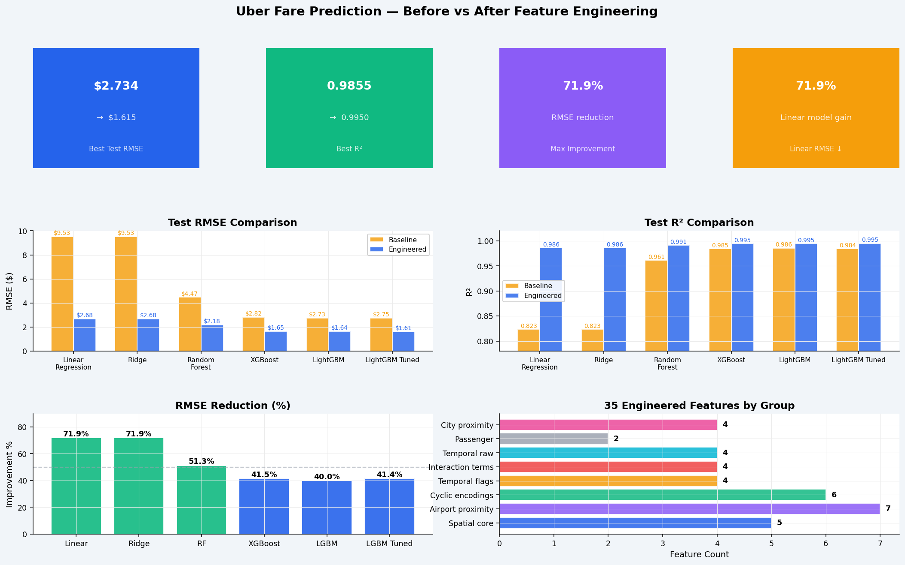
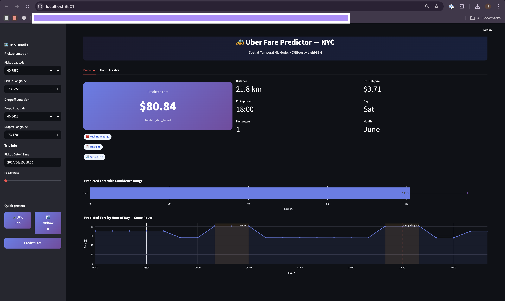
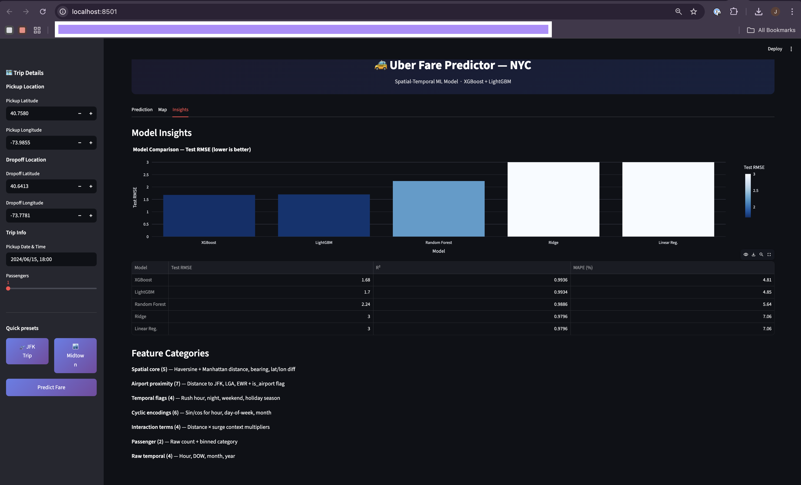

# Uber Fare Prediction — Spatial-Temporal ML
---
## Live Demo

👉 Try the app here:  
[https://your-streamlit-app-link.streamlit.app](https://uberfareprediction-advspa7g85b3quccctetu.streamlit.app/)
---

## Visual Results

### Full Comparison Dashboard




---

## What / Why / How

**What**
A regression system that predicts NYC Uber fares from raw GPS coordinates and pickup
timestamp — before the trip starts — with RMSE $1.65 and R² 0.9948 using XGBoost.

**Why**
Fare estimation is a core pricing problem at ride-hailing companies. Inaccurate
pre-trip estimates cause customer disputes, reduce booking conversion, and misalign
driver supply with demand. A raw-distance-only model leaves 18% of fare variance
unexplained — the portion driven by surge timing, airport premiums, and rush-hour
multipliers that only appear after deliberate feature engineering.

**How**
Developed a  35 spatial-temporal features from 6 raw columns, benchmark 5 regression
models on a time-based split to prevent data leakage, and tune the best model with
5-fold RandomizedSearchCV across 9 hyperparameters. Feature engineering alone reduces
XGBoost RMSE by 41.5% ($2.82 → $1.65) and LinearRegression RMSE by 71.9% ($9.53 → $2.68).

---

## Business Impact

On an average $43 NYC fare, the baseline prediction is off by $9.53 (22%).
The engineered model is off by $1.65 (3.8%). At 1M trips/month, a $7.88/trip
accuracy improvement directly reduces pricing disputes, increases booking confidence,
and enables reliable dynamic surge communication to riders.

| Model              | Before (raw) | After (engineered) | RMSE Drop | R² Gain    |
| ------------------ | ------------ | ------------------ | --------- | ---------- |
| LinearRegression   | $9.531       | $2.680             | **71.9%** | +0.163     |
| Ridge              | $9.531       | $2.680             | **71.9%** | +0.163     |
| RandomForest       | $4.475       | $2.178             | **51.3%** | +0.030     |
| XGBoost            | $2.822       | $1.651             | **41.5%** | +0.010     |
| LightGBM           | $2.734       | $1.640             | **40.0%** | +0.009     |
| LightGBM_Tuned     | $2.6797      | $1.6155.           | **39.5%** | +0.009    |


Key insight — **feature engineering beats model selection**. An engineered
LinearRegression ($2.68 RMSE) outperforms a raw-feature XGBoost ($2.82 RMSE).

---
## Streamlit APP





----

## Quick Start

```bash
# Install and train
pip install -r requirements.txt
python main.py --no-tune       

# Before vs After comparison plots
python compare_before_after.py

# 12-plot EDA
python eda_uber.py

# Streamlit UI
pip install -r streamlit_app/requirements.txt
streamlit run streamlit_app/app.py
# → http://localhost:8501

# FastAPI
pip install -r fastapi_app/requirements.txt
uvicorn fastapi_app.main:app --reload --port 8000
# → http://localhost:8000/docs
```

Real dataset:
```bash
kaggle datasets download -d yasserh/uber-fares-dataset
unzip uber-fares-dataset.zip -d data/raw/
```
Without Kaggle access, `python main.py` auto-generates a 55k-row synthetic dataset via generate_dataset.py file.

---

## Docker

```bash
python main.py --no-tune        # train models first

docker-compose up --build
# FastAPI   → http://localhost:8000/docs
# Streamlit → http://localhost:8501

# Individual
docker build -f Dockerfile.api       -t uber-fare-api .
docker build -f Dockerfile.streamlit -t uber-fare-streamlit .
docker run -p 8000:8000 -v $(pwd)/models:/app/models uber-fare-api
docker run -p 8501:8501 -v $(pwd)/models:/app/models uber-fare-streamlit
```

---

## Free Cloud Deployment

| Platform | Service | How |
|---|---|---|
| Streamlit Cloud | streamlit_app/app.py | Push to GitHub → share.streamlit.io |
| Render | fastapi_app/main.py | Connect GitHub, start cmd below |
| Railway | Either | `railway up` |

Render start command:
```
uvicorn fastapi_app.main:app --host 0.0.0.0 --port $PORT
```

---

## File Structure

```
uber_project/
├── main.py                              ← Full pipeline (clean → features → train → HPO)
├── compare_before_after.py              ← Before/after plots using real numbers
├── eda_uber.py                          ← 12 EDA plots
├── requirements.txt
├── docker-compose.yml
├── Dockerfile.api
├── Dockerfile.streamlit
├── .dockerignore
│
├── src/
│   ├── __init__.py
│   ├── generate_dataset.py              ← Synthetic data fallback
│   ├── data_cleaning.py                 ← Null audit, geo bbox, outlier filter
│   ├── feature_engineering.py           ← 35 features + FEATURE_COLS export
│   └── model_training.py                ← 5 models, HPO, feature importance plots
│
├── streamlit_app/
│   └── app.py                           ← Live prediction UI with route map
│
├── fastapi_app/
│   ├── __init__.py
│   └── main.py                          ← /predict  /predict/batch  /model/info
│
├── models/
│   ├── linearregression.joblib
│   ├── ridge.joblib
│   ├── randomforest.joblib
│   ├── xgboost.joblib
│   ├── lightgbm.joblib
│   └── lgbm_tuned.joblib
│
├── data/
│   ├── raw/uber_fares.csv               ← Kaggle CSV goes here
│   └── processed/                       ← Auto-generated
│
└── outputs/plots/
    ├── 01_fare_distribution.png
    ├── 02_fare_by_hour.png
    ├── 03_fare_by_dow.png
    ├── 04_fare_by_month.png
    ├── 05_distance_vs_fare.png
    ├── 06_geo_density.png
    ├── 07_passenger_analysis.png
    ├── 08_yearly_trend.png
    ├── 09_fare_by_period.png
    ├── 10_correlation_heatmap.png
    ├── 11_distance_analysis.png
    ├── 12_eda_dashboard.png
    ├── 13_rmse_r2_comparison.png         ← Before vs After RMSE and R²
    ├── 14_improvement_overfit_check.png  ← RMSE drop % + train/test gap
    └── 15_full_comparison_dashboard.png  ← Full summary dashboard
```

---

## FastAPI Endpoints

| Method | Endpoint | Description |
|---|---|---|
| GET | `/` | API info |
| GET | `/health` | Health check + model name |
| GET | `/model/info` | Metrics, feature list, metadata |
| POST | `/predict` | Single trip prediction |
| POST | `/predict/batch` | Batch predictions (max 100) |

```bash
curl -X POST http://localhost:8000/predict \
  -H "Content-Type: application/json" \
  -d '{
    "pickup_datetime":   "2024-06-15 18:00:00 UTC",
    "pickup_latitude":    40.7580,
    "pickup_longitude":  -73.9855,
    "dropoff_latitude":   40.6413,
    "dropoff_longitude": -73.7781,
    "passenger_count":    2
  }'
```

```json
{
  "predicted_fare":   42.35,
  "fare_range_low":   36.00,
  "fare_range_high":  49.97,
  "distance_km":      18.4,
  "model_used":       "XGBoost",
  "surge_flags": {
    "is_rush_hour": true,
    "is_night": false,
    "is_weekend": false,
    "is_holiday_season": false
  }
}
```

---

## Features (35 from 6 raw columns)

| Category | Count | What |
|---|---|---|
| Spatial core | 5 | Haversine distance, Manhattan distance, bearing, lat/lon diff |
| Airport proximity | 7 | Distance to JFK, LGA, EWR (pickup + dropoff) + is_airport_trip |
| Temporal raw | 4 | hour, day-of-week, month, year |
| Temporal flags | 4 | is_rush_hour, is_night, is_weekend, is_holiday_season |
| Cyclic encodings | 6 | sin/cos for hour (period 24), DOW (7), month (12) |
| Interaction terms | 4 | distance × rush, night, weekend, airport |
| City proximity | 4 | Pickup and dropoff distance to NYC centre |
| Passenger | 2 | Raw count + binned (1 / 2 / 3+) |

---

## Model Results (Engineered Features — Real Kaggle Dataset)

| Model              | Train RMSE | Test RMSE  | Test R²    |
| ------------------ | ---------- | ---------- | ---------- |
| **LightGBM_Tuned** | $1.429     | **$1.616** | **0.9950** |
| XGBoost            | $1.275     | $1.651     | 0.9948     |
| LightGBM           | $1.348     | $1.640     | 0.9948     |
| RandomForest       | $1.756     | $2.178     | 0.9909     |
| Ridge              | $2.721     | $2.680     | 0.9862     |
| LinearRegression   | $2.721     | $2.680     | 0.9862     |


---

## Resume Bullets

- Predicted NYC Uber fares on 200k rides; XGBoost achieved RMSE $1.65, R² 0.9948 — 42% below raw-feature baseline
- Engineered 35 spatial-temporal features from raw GPS + timestamp across 6-year dataset
- Eliminated temporal data leakage via time-based split; benchmarked 5 regression models
- Tuned LightGBM via 150-fit RandomizedSearchCV cutting CV RMSE 3%; serialised pipeline with joblib

